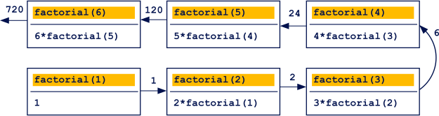

# Parameters validation

As we said, the `return` keyword can be used to interrupt a function in case of errors. An example of this is the validation of function parameters.

Returning to the `getMeanTemp` function example, we can check if the value passed as argument is actually an array:

```javascript
function getMeanTemp(temperatures) {
     if (!(temperatures instanceof Array)) {
         return NaN;
     }
     let sum = 0;
     for (let i = 0; i < temperatures.length; i++) {
         sum += temperatures[i];
     }
     return sum / temperatures.length;
}
console.log(getMeanTemp(10));       // -> NaN
console.log(getMeanTemp([10, 30])); // -> 20
```

# Recursion

To get a shorter and more compact code, we can use a **recursion**. The concept of recursion is that, when calling a function, that function calls itself **while** executing. An example of this is a function to calculate the factorial of a number:

```javascript
function factorial (n) {
     return n > 1 ? n * factorial(n - 1) : 1;
}
console.log(factorial(6)); // -> 720
```

We used the ternary operator instead of a conditional one. We check if `n` is greater than `1`.

- If it is, we multiply it by the `factorial` function of `n - 1`.
- If it isn't, we return `1`.

This image shows the process:

<span style="background-color: white; display: inline-block;">
  
</span>

Recursion is commonly used, but must be handled with care. Do not use it when you can't estimate the number of embedded calls. Also, be very careful when formulating the interrupt condition.

# Functions as first-class members

In JavaScript, functions are first-class members. This term means that functions can be treated as any data, which can be stored in variables or passed as arguments to other functions.

For example, we can declare the `showMessage` function and then store its memory address reference in the variable `sm`:

```javascript
function showMessage(message) {
     console.log(`Message: ${message}`);
}
let sm = showMessage;
```

We can store any function accessible in this scope in a variable and use a function call operator `( )` to execute it. We can check that the `sm` variable is now a function by using the `typeof` operator:

```javascript
sm("This works!"); // -> Message: This works!
console.log(typeof sm); // -> function
```

**Notice and remember** that when assigning a function to a variable, we don't use the function call operator `( )`, as it would execute the function and assign its return value to the variable, instead of the function itself:

```javascript
function doNothing() {
     return undefined;
}
let a = doNothing(); // assign result of function call
let b = doNothing;   // assign a function
console.log(typeof a); // -> undefined
console.log(typeof b); // -> function
```

In the example, the result of the `doNothing` function call is stored in the a variable, while a reference to the `doNothing` function is stored in the b variable.

This is useful when passing the function as a call parameter to other functions, which we'll see soon. For now, let's test something feasible:

```javascript
function add(a, b) {
     return a + b;
}
function multiply(a, b) {
     return a * b;
}
function operation(func, first, second) {
     return func(first, second);
}
console.log(operation(add, 10, 20)); // -> 30
console.log(operation(multiply, 10, 20)); // -> 200
```

The `operation` function takes as its first argument the function (parameter `func`) and calls it with the other two arguments passed (parameters `first` and `second`).

# Function expressions

To store a function in a variable or pass it as an argument to call a function, you do not necessarily have to declare it previously and use its name.

Let's go back to our example with the add function:

```javascript
function add(a, b) {
     return a + b;
}
let myAdd = add;
console.log(myAdd(10, 20)); 	// -> 30
console.log(add(10, 20));	// -> 30
```

We first create the `add` function then store it in `myAdd`. We can call the same function with its name or the variable that references it, but we can shorten it by simply declaring and initializing the variable `myAdd` with the declaration of the function:

```javascript
let myAdd = function add(a, b) {
     return a + b;
}
console.log(myAdd(10, 20)); // -> 30
console.log(add(10, 20)); // -> 30
```

Returning to the concept of anonymous functions, it may see incomprehensible to use a name to refer to a function, but in this case it's about anonymity (meaning the lack of name) in the initialization of a function.

For example:

```javascript
function operation(func, first, second) {
     return func(first, second);
}
let myAdd = function(a, b) {
     return a + b;
}
console.log(operation(myAdd, 10, 20)); // -> 30
console.log(operation(function(a, b) {
     return a * b;
}, 10, 20)); // -> 200
```

- In the first step, we declare the function `operation`. It is a named function, and we use the function statement here, so we will refer to the function by its name.
- In the next step, we define an anonymous function, which we store in the `myAdd` variable. Here, we used a function expression.
- We call the `operation` function, passing the `myAdd` function and values `10` and `20` as arguments. The result is easily predicted.
- Then, we call `operation`, and its first argument will be an anonymous function, defined directly during `operation` call.

That last point may seem a useless mechanism, but it is used often.

# Callbacks

Functions passed as arguments to other functions are an important part of programming. They are called **callback functions**. There are two types of callback functions:

- Synchronous
- Asynchronous

## Synchronous callbacks

Synchronous execution is when subsequent instructions are executed in the order in which they are placed in the code. Example:

```javascript
let inner = function() {
     console.log('inner 1');
}
let outer = function(callback) {
     console.log('outer 1');
     callback();
     console.log('outer 2');
}
console.log('test 1');
outer(inner);
console.log('test 2');
```

This code will write to the console:

```
test 1
outer 1
inner 1
outer 2
test 2
```

So, the order of actions resulting from the order of calling the commands and functions is maintained. However, this order may be disturbed under certain special circumstances.

## Asynchronous callbacks

Asynchrony is a complex topic, and depends on the programming language and, often, on the environment too.

For client-sided JavaScript, it is based on event-based programming, meaning the asynchronous responses to certain events. An event is a signal that can be sent by a timer, a user action, or information/data by the server.

Using appropriate functions, we combine a specified event with a selected callback function, which will occur when the event happens.

One of the simplest cases of asynchronous execution is the use of the `setTimeout()` function. This function takes as argument another function (callback) and a specified time expressed in milliseconds. After the time expires, the callback function is executed. Meanwhile, the next program instructions after `setTimeout()` are executed.

So, the callback function's call is not determined by its order but by a specified time delay, which only applies to the callback function specified in `setTimeout()`, while the rest of the code is executed synchronously.

Modifying the previous example, we do not call `callback()` immediately but pass it as an argument to `setTimeout()` with a 1000 ms delay:

```javascript
let inner = function() {
console.log('inner 1');
}
let outer = function(callback) {
console.log('outer 1');
setTimeout(callback, 1000) /*ms*/;
console.log('outer 2');
}
console.log('test 1');
outer(inner);
console.log('test 2');
```

The result will be as follows, with the last line being delayed by one second:

```
test 1
outer 1
outer 2
test 2
...
inner 1
```

# The `setTimeout()` and `setInterval()` functions

We have seen that `setTimeout()` is used when we want to cause a delayed action.

A similar function is `setInterval()`. When using it, the action is also performed with a delay, but it is executed periodically after the specified interval. In the meantime, the main program is being executed, occasionally being halted when the callback specified in `setInterval()` is called. During the call, `setInterval()` returns an identifier, which can be used to remove the timer used in it, so the cyclical callback is stopped. 

Example:

First, we run `setInterval()`, which will call the `inner()` function in one-second intervals. Then we call `setTimeout()`, which will turn off the timer associated with `setInterval()` after 5.5 seconds. As a result, `inner()` should be called five times. Meanwhile, the rest of the program will be executed.

```javascript
let inner = function() {
console.log('inner 1');
}

let outer = function(callback) {
console.log('outer 1');

let timerId = setInterval(callback, 1000) /*ms*/;
console.log('outer 2');

setTimeout(function(){
     clearInterval(timerId);
}, 5500);
}

console.log('test 1');
outer(inner);
console.log('test 2');
```

The results of the execution should be:

```
outer 1
outer 2
test 2
...
inner 1
inner 1
inner 1
inner 1
inner 1
```
<hr>

Usually, though, asynchronous function calls are not related to timers, but generated outside of the program. For example, as already said, an action by the user. These scenarios will be analyzed better in the next part of the course, devoted to the integration of client-side JavaScript and the DOM.

We will, however, analyze an example that will illustrate a simplified situation.

If we run the JavaScript code on the client side, in the browser, it is always associated with the website. The window in which this page is located is represented in the client-side JavaScript by a global window variable.

The window object has a method named `addEventListener`. This function allows you to register a certain action to be performed in response to a window-related event.

Such an event can be a "click", which is a single mouse click on any place on the page. There is a limited set of named events associated with a particular object, to which it can react.

The action to be taken is passed to the `addEventListener` method as a callback function.

```javascript
window.addEventListener("click", function() {
     console.log("clicked!");
});
```

Try to execute the sample code. Nothing special should happen immediately after it is started.

Only when you click anywhere on the page should a message appear on the console: "clicked!". Our function is not called until the "click" event occurs, which is absolutely asynchronous.

In the meantime, between subsequent clicks, the rest of the program could be executed, if we had a whim to write it.

# Arrow functions

An **arrow function** is a shorter form of a function expression. An arrow function expression is composed of:

- Parantheses containing zero to multiple parameters. If exactly one parameter is present, parentheses can be omitted.
- An arrow that looks like this: `=>`.
- The body of the function, which can be surrounded by curly brackets if it's longer.
- If an arrow function has only one statement and returns its value, we can omit the `return` keyword, as it will be added implicitly.

For example, recalling the previous function `add`:

```javascript
let add = function(a, b) {
     return a + b;
}
console.log(add(10, 20)); // -> 30
```

Can be written as:

```javascript
let add = (a, b) => {
     return a + b;
}
console.log(add(10, 20)); // -> 30
```

Or simplified even more, as the function has only one statement, whose value returns:

```javascript
let add = (a, b) => a + b;
console.log(add(10, 20)); // -> 30
```

Let's return to the examples with the recursive `factorial` function, which takes exactly one parameter `n`. In the previous example, we declared it using the statement:

```javascript
function factorial(n) {
     return n > 1 ? n * factorial(n - 1) : 1;
}
console.log(factorial(5)); // -> 120
```

Using the arrow function expression, we can write it in an even more compact form. Note that this time, the parameter is not given in parentheses. Since the function returns the result of exactly one statement, the `return` keyword can also be omitted.

The arrow expression is mainly used for short functions, often anonymous, which can be presented as even more compact in this form. They differ from ordinary functions by one more thing apart from the form of notation, in other words, how the keyword `this` is interpreted inside them. However, this is a topic related to more advanced object-oriented programming, which is far beyond the scope of this course.

One typical example of using arrow functions is the `forEach` method, available in `Array` type data. We have learned several ways of passing through array elements, using different types of loops. The `forEach` method is another, and frankly speaking, currently the most used one. This method takes as an argument a function.

This function will be called each time for each element of the array. We can create any function for this purpose. There is one condition, which is that it must have at least one parameter, which will be treated as a visited element of the array (the syntax of this function may be a bit more complex, but we will explain it in the next part of the course). Let's look at a simple example:

```javascript
let names = ['Alice', 'Eve', 'John'];
function showName(element) {
     console.log(element);
}
names.forEach(showName); // -> Alice, Eve, John
```

The `showName` function has been passed as a call argument to the `forEach` method of the names array. Therefore, `showName` will be called three times, for each element of the names array, and in each call its parameter will be equal to the successive name, i.e. in turn: `Alice`, `Eve` and `John`. The only thing `showName` has to do is to display the received `element` (name).

The same effect can be achieved by passing an anonymous arrow function to the forEach method. We do not even store it in a variable, because we assume that we will use it only here and will not refer to it again.