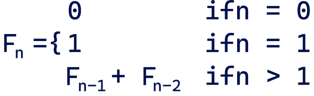

**Exercise 1:** Arrays in JavaScript have a `sort` method available which, as you might guess, allows you to sort its elements. This method takes as an argument a function that will compare two elements of the array.

The function should return zero if we consider the arguments to be the same, a value less than zero if we consider the first one to be smaller than the second, and a value larger than zero otherwise. Take a look at the example:

```javascript
let numbers = [50, 10, 40, 30, 20];
function compareNumbers(a, b) {
     let retVal = 0;
     if (a < b) {
         retVal = -1;
     } else if(a > b) {
         retVal = 1;
     }
     return retVal;
}
let sorted = numbers.sort(compareNumbers);
console.log(sorted); // [10, 20, 30, 40, 50]
```

<details>
<summary>Hint</summary>

JavaScript's `sort()` function only needs to know:

- A negative number if a should come before b
- A positive number if a should come after b
- Zero if they're equal
</details>

<br>

**Task 1A.** Try to modify the above piece of code to make it as short as possible. Suggestions:

- Use an anonymous function;
- Use an arrow function;
- Consider skipping the `if` statement.

<details>
<summary>Sample Solution</summary>

```javascript
let numbers = [50, 10, 40, 30, 20];

let sorted = numbers.sort((a, b) => a - b);

console.log(sorted); // [10, 20, 30, 40, 50]
```
</details>

<br>

**Task 1B.** Then modify the function so that the elements are sorted in descending order, not in ascending order as in the example.

<details>
<summary>Sample Solution</summary>

```javascript
let numbers = [50, 10, 40, 30, 20];

let sorted = numbers.sort((a, b) => b - a);

console.log(sorted); // [10, 20, 30, 40, 50]
```
</details>

<hr>

**Exercise 2:** Write three functions with the names `add`, `sub`, and `mult`, which will take two numerical arguments. The functions are to check if the given arguments are integers (use `Number.isInteger()`). If not, they return `NaN`, otherwise they return the result of addition, subtraction, or multiplication respectively. The functions are to be declared using a function statement.

Example of use and expected results:

```javascript
console.log(add(12, 10)); // -> 22
console.log(mult(12, 10.1)); // -> NaN
```

<details>
<summary>Sample Solution</summary>

```javascript
function add(a, b) {
    if (!Number.isInteger(a) || !Number.isInteger(b)) {
        return NaN;
    }
    return a + b;
}

function sub(a, b) {
    if (!Number.isInteger(a) || !Number.isInteger(b)) {
        return NaN;
    }
    return a - b;
}

function mult(a, b) {
    if (!Number.isInteger(a) || !Number.isInteger(b)) {
        return NaN;
    }
    return a * b;
}
```
</details>

<details>
<summary>My Solution</summary>

```javascript
function add(n1, n2){
    return (Number.isInteger(n1) && Number.isInteger(n2)) ? (n1 + n2) : NaN;
}

function sub(n1, n2){ 
    return (Number.isInteger(n1) && Number.isInteger(n2)) ? (n1 - n2) : NaN;
}

function mult(n1, n2){
    return (Number.isInteger(n1) && Number.isInteger(n2)) ? (n1 * n2) : NaN;
}
```
</details>

<hr>

**Exercise 3:** Rewrite the functions from the previous task using an arrow function expression, trying to write them in the shortest possible form.

Example of use and expected results:

```javascript
console.log(sub(12, 10)); // -> 2
console.log(mult(10, 10.1)); // -> NaN
```

<details>
<summary>Sample Solution</summary>

```javascript
let add = (a, b) => !Number.isInteger(a) || !Number.isInteger(b) ? NaN : a + b;
let sub = (a, b) => !Number.isInteger(a) || !Number.isInteger(b) ? NaN : a - b;
let mult = (a, b) => !Number.isInteger(a) || !Number.isInteger(b) ? NaN : a * b;
```
</details>

<hr>

**Exercise 4:** Write an `action` function that will take the callback function as its first argument and the other two arguments as numbers. As a callback function, you will be able to pass one of the three functions from the previous task. The `action` function will call the callback function passed to it and will return the obtained result. The callback function will accept the second and third arguments from the `action` call.

Example of use and expected results:

```javascript
console.log(action(add, 12, 10)); // -> 22
console.log(action(sub, 12, 10)); // -> 2
console.log(action(mult, 10, 10.1)); // -> NaN
```

<details>
<summary>Sample Solution</summary>

```javascript
let action = (callback, a, b) => callback(a, b);

// or

let action = function (callback, a, b) {
    return callback(a, b);
}

// or

function action(callback, a, b) {
    return callback(a, b);
}
```
</details>

<hr>

**Exercise 5:** Write a program that will print out (to the console) consecutive integers 10 times, in two-second intervals (start with the number 1). Use the functions `setInterval`, `clearInterval` and `setTimeout`.

```
1
2
3
4
5
6
7
8
9
10
```

<details>
<summary>Hint</summary>

`setInterval` and `setTimeout` require a function **reference**, not a function **call**.
So using `console.log` or `clear.Interval` directly is a mistake because they return **values**, not **references**.

</details>

<details>
<summary>Sample Solution</summary>

```javascript
let counter = 1;
let intervalId = setInterval(function () {
    console.log(counter++);
}, 2000);
setTimeout(function () {
    clearInterval(intervalId)
}, 20100);
```
</details>

<hr>

**Exercise 6:** Write a function that will calculate the n-th element of the Fibonacci sequence. This sequence is defined by a formula:

<span style="background-color: white; display: inline-block;">
  
</span>

So each element of the sequence (except the first two) is the sum of the previous two. For example: $F1 = 1, F2 = F1 + F0 = 1, F3 = F2 + F1 = 2 \text{ and } F6 = F5 + F4 = 8$. The function should use recursion. In the definition, use a function expression (store an anonymous function in a variable).

Example of use and expected results:

```javascript
console.log(fibbRec(4)); // -> 3
console.log(fibbRec(7)); // -> 13
```

<details>
<summary>Sample Solution</summary>

```javascript
let fibbRec = function (n) {
    let retVal = 0;
    if (n != 0) {
        if (n === 1) {
            retVal = 1;
        } else {
            retVal = fibbRec(n - 1) + fibbRec(n - 2);
        }
    }
    return retVal;
}
```
</details>

<details>
<summary>My Solution</summary>

```javascript
let fibbRec = (n) => {

    if (n === 0) {
        return 0;
    }
    if (n === 1){
        return 1;
    }

    return fibbRec(n-1) + fibbRec(n-2);
};
```
</details>


<hr>

**Exercise 7:** Rewrite the function from Exercise 6 using an arrow function expression, but try to shorten its code as much as possible (use conditional operators, and try not to use additional variables other than the parameter `n`).

<details>
<summary>Sample Solution</summary>

```javascript
let fibbRec = (n) => (n == 0) ? n : ((n == 1) ? n : (fibbRec(n-1) + fibbRec(n-2)));
```
</details>

<hr>

**Exercise 8:** Write an iterative version of the function from Exercise 6 (use the `for` loop). Declare the function using a function statement.

<details>
<summary>Sample Solution</summary>

```javascript
function fibbIter(n) {
    let a = 0, b = 1;
    for (let i = 2; i <= n; i++) {
        let c = a;
        a = b;
        b += c;        
    }
    return b;
}
```
</details>