# Testing and debugging

Let's look at this example:

```javascript
function average(a, b) {
    return a + b / 2;
}
 
console.log(average(2, 10));   // -> 7 expected: 6
console.log(average(5, 5));    // -> 7.5 expected: 5
```

The function looks simple: it adds two given numbers and divides them by 2. This code has valid syntax, there are no formal problems with it, and we expect the results of the two calls in the example to be 6 and 5. But when we run this code, the results are very different. The error is:

```javascript
return a + b / 2;
```

The problem is the order of operations. `b / 2` is calculated first, then added to `a`. So it's the same as:

```javascript
return a + (b / 2);
```

For the result we expect, the code should be:

```javascript
return (a + b) / 2
```

This is a good example of a logical error. The code is valid from the JavaScript point of view, but the value returned is not the one we intended. These errors are the hardest to find if we do not test properly.

Another example of a non-obvious error:

```javascript
function largest(a, b, c) {
    if (a > b && a > c) {
        return a;
    } else if (b > a && b > c) {
        return b;
    } else {
        return c;
    }
}
```

We see a function that should return the largest of three numbers. The idea of how to solve this problem is simple: 
- When variable `a` is bigger than `b` and `c`, `a` is the largest number.
- If this isn’t the case, then if `b` is bigger than `a` and `c`, `b` is the largest number.
- If neither is true, that means that `c` is the largest number.

Try to spot the flaw in this logic. As a hint, try to call the largest function with these sets of parameters:

```javascript
console.log(largest(1, 1, 2)); // -> 2
console.log(largest(1, 2, 3)); // -> 3
console.log(largest(3, 2, 1)); // -> 3
console.log(largest(2, 2, 1)); // -> 1
```

Can you now spot the error based on when it occurs?

If the first and second numbers are equal, the function incorrectly returns the third value. This is due to the fact that when `a` and `b` are equal, both `a > b` and `b > a` are not `true`. This error is much harder to find, as this code does what it should most of the time, and only in specific cases does it return incorrect values. When found, the problem is rather easy to fix, as we only need to change the greater than operator to a greater than or equal to operator inside our `if` statement.

# Debugging

To be conducted efficiently, debugging requires tools, and if our code is executed in the browser, we almost certainly have all the necessary tools already available.

To check if our browser supports this functionality, we can simply try to execute this code with the developer console opened:

```javascript
console.log("Before debugger");
debugger;
console.log("After debugger");
```

If the debugger is present, the console will show only the "Before debugger" log, and depending on the installed browser, we should see information about code execution either stopped, or paused in the debugger, or in debug mode.

The second log message is not displayed because the `debugger` statement works as a breakpoint in the code execution. So whenever JavaScript encounters the debugger statement, it checks if the debugger is present, and if so, code execution is halted at that exact point. This of course is not helpful by itself, but this is only the beginning of the features of the debugger.

# Step-by-step program execution

One of the main features of the debugger is its ability to execute code on a **step-by-step** basis. This means that we can stop program execution at any place using a `debugger` statement, and then continue execution one instruction at a time.

This is helpful when we suspect that the program behavior or logic is flawed, and the code goes to an incorrect branch of execution. In this mode, we can see each line that is executed, and each line that is not. We can easily see if the logic in the flow control statements is valid or not.

So we know already that the `debugger` statement, when encountered by JavaScript, will stop code execution at that place. Depending on the browser we’re using, the flow control buttons can look different, and can be located in different places. In general, all modern browsers support the following options to control the execution of the script in debug mode:

- **Resume / Continue**
    - This will resume the execution of the script in a normal way, and is used when we’ve checked what we wanted to check, and now we want to continue with the execution of the script.

- **Step Into**
    - This executes the next instruction in the code only, and pauses it again, and we use this when we want to analyze the code in detail, or check which exact path the execution takes when complex branching is happening due to cascading `if ... else` statements, or other complicated logic. If the next instruction is a function call, using Step Into will jump inside the code of this function.

- **Step Over**
    - This works like Step Into, except that if this is used when the next instruction is a function call, the code will not jump into the function code, but the whole function will be executed, and the program will be paused again after jumping out of this function. This is often used when the next instruction is a call to a function where we don’t know if it will have any impact, or we’re simply not interested in looking.

- **Step Out**
    - This allows us to immediately jump out of a function in which the code is paused.

Let's try to practice some basic actions that can be performed with the debugger. The JavaScript program we will be debugging should be rewritten in your local development environment.

# Preparation of the environment and an example

Create two files in any code editor (we described how to configure the local environment in the "Development tools" chapter): `index.html` and `main.js`. In the index.html file, place the code for this very simple HTML web page:

```html
<!DOCTYPE html>
<html>
<head>
    <script src="main.js"></script>
</head>
<body>
    <p>Test Site</p>
</body>
</html>
```

Save the file to your local drive, preferably in a newly-created, empty directory. In the same directory, save the `main.js` file (which, as you may have noticed, is referenced in the `index.html` code), placing the following code inside it:

```javascript
function outer() {
    let name = "outer";
    let str = inner();
    return str;
}
 
function inner() {
    let name = "inner";
    return "Hello !";
}
 
console.log("before outer() call");
console.log(outer());
console.log("after outer() call");
```

In the browser you are using, open a new tab and load the `index.html` file into it. Depending on your browser and system, you can either use the program menu or the appropriate keyboard shortcut (in Linux and Windows: `Ctrl + O`, in macOS: `⌘ + O`).

If everything has been done correctly, you will see this text in the tab: `Test Site`.

Now we need to start the Developer Tools. For example, in Chrome and Firefox browsers, on Windows and Linux, we use the key combination: `Ctrl + Shift + I`. In the remainder of this exercise, we will limit ourselves to discussing how the debugger works using the Chrome and Firefox browsers as examples.

Select Console from the Developer Tools tabs. Reload the page (key combination `Ctrl + R` or `⌘ + R`). The following messages should appear on the console:

```javascript
before outer() call
Hello !
after outer() call
```

This is the result of the `console.log` methods from the program written in the `main.js` file. If everything has worked so far, we are ready to start playing with debugging.

# Use of the `debugger` statement

Place `debugger` in the `main.js` code before calling the function `outer`. So the last lines of the `main.js` file should now look like this:

```javascript
console.log("before outer() call");
debugger;
console.log(outer());
console.log("after outer() call");
```

Do not forget to save the modified file.

Go back to your browser and reload the page. What has happened? First of all, in the Developer Tools, the selected tab has changed: in Chrome, it will be to Sources, in Firefox to Debugger. The debugger statement causes the program to stop its execution on the line where we put it and wait for our decision. In the tab, among other information, you should see the code of our program, with the line on which the execution has stopped clearly highlighted.

In Sources / Debugger view, we also have the option to use the console (we don't have to switch to the Console tab). Try pressing the Esc key several times. Notice that the console will appear and disappear at the bottom of the tab. For further work, leave it visible. Since only one `console.log` is executed before the program stops, you should only see the following in the console:

```
before outer() call
```

Chrome:

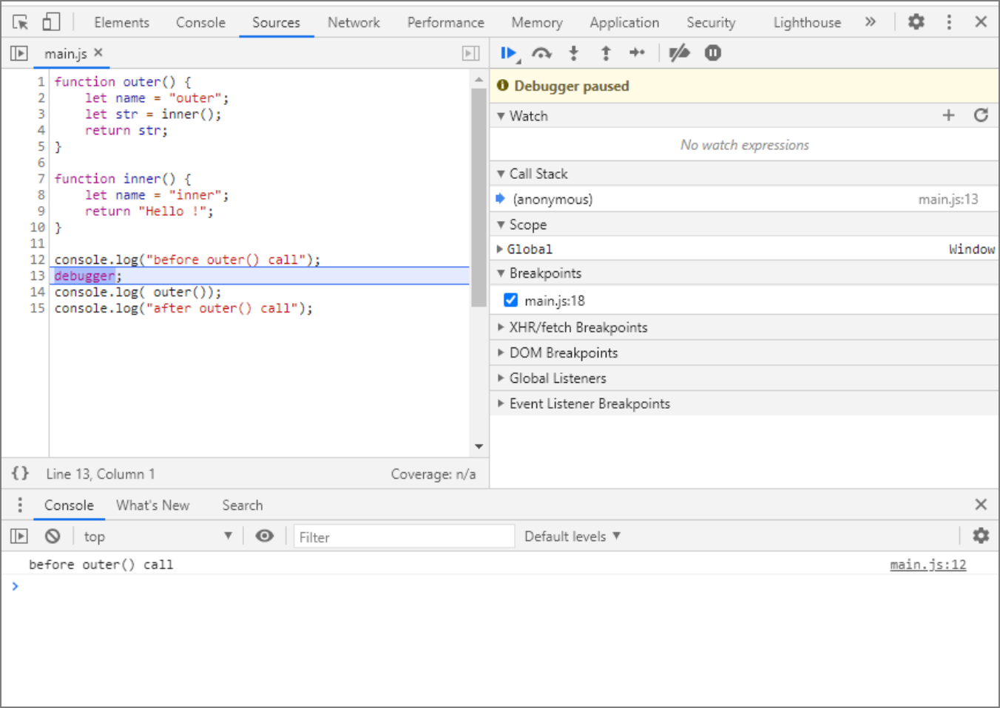

Firefox:

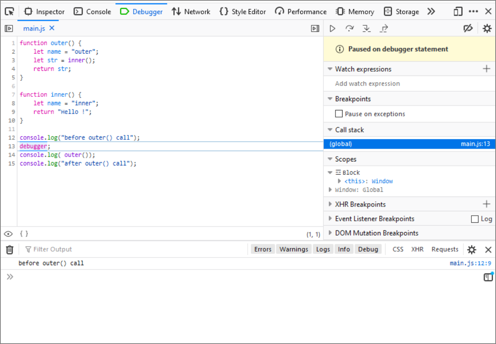

Let’s now try some simple scenarios.

# Resume Execution

To the right of the tab, locate the **Resume** button (the triangle icon rotated to the right: play). If you hover your mouse over this button, a tooltip should appear so that you can make sure it's the right button. Press this button, or use the keyboard shortcut `F8`.

As a result, the program will move on, and without stopping any more, it will execute to the end by itself. The console should now show the complete information generated by the program:

```
before outer() call
Hello !
after outer() call
```

Using **Resume** does not necessarily cause the program to execute to completion. We can indicate where it should stop again.

Reload the page again. Notice that the debugger displays line numbers to the left of the code. Click on the number 15, indicating the last line in our code. This is how we set the breakpoint (the line will be highlighted). Click on the line number again if you want to remove the breakpoint (do not delete it yet).

If we now click on the **Resume** button (or use F8) the program will move on and will stop at the breakpoint. As a result, the console will display the following text:

```
before outer() call
Hello !
```

Chrome:

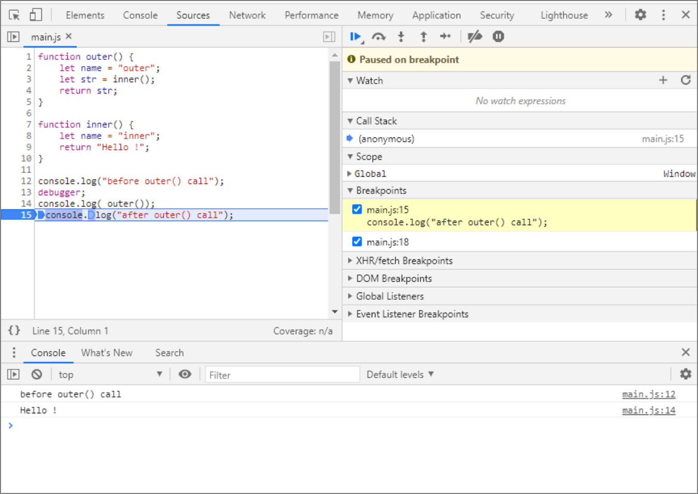

Firefox:

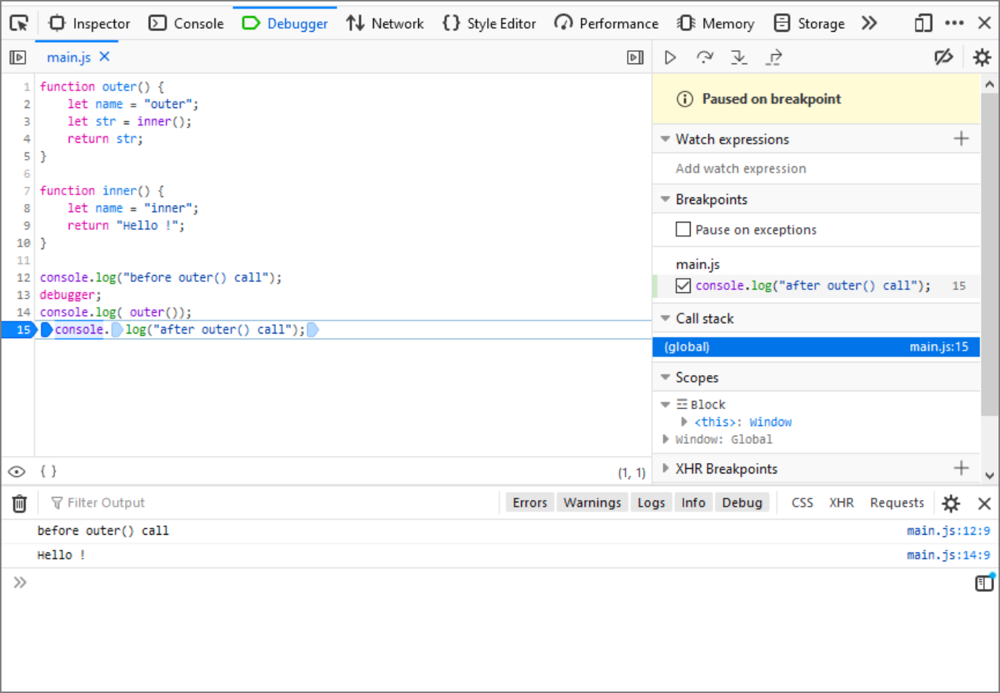

Only by clicking **Resume** again will the program execute to completion, and the console will show:

```
before outer() call
Hello !
after outer() call
```

To be honest, when debugging code, we rarely use the debugger statement. Most often, at the place where the program should stop, we just indicate it using breakpoints set directly in the Developer Tools. Before further work, remove the breakpoints by clicking on the appropriate line numbers.

# How to deal without `debugger` statement

Again, modify the program saved in `main.js`, this time removing the line containing the debugger command.

Save the changes, go back to your browser and reload the page. Obviously the program has executed to the end, but we now know how to stop it. Set two breakpoints, one on the `console.log("before outer() call");` the other on the `console.log("after outer() call");`. These should now be lines 12 and 14 respectively.

Reload the page. The program should stop at the first breakpoint. Clicking **Resume** will cause the program to resume execution and stop at the second breakpoint.

Another click on **Resume** will cause the program to execute to the end.

Chrome:

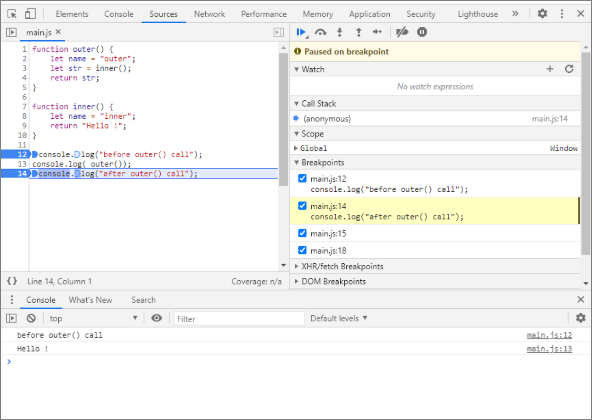

Firefox:

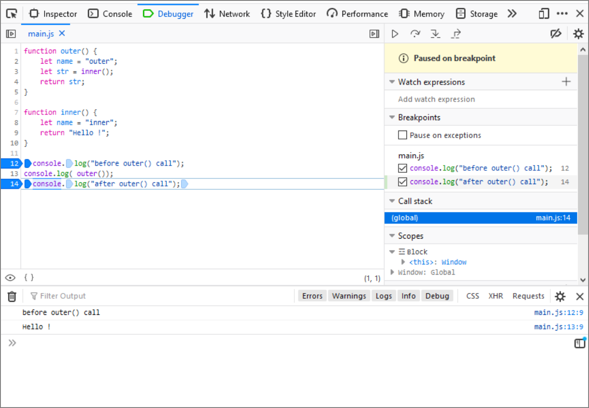

# Step Over

Apart from jumping between successive breakpoints with **Resume**, we have the possibility to perform a real step-by-step execution. There is a small problem here. If an instruction is a call to a function, should the debugger go inside the function and execute the instructions inside it step by step, or treat it as an indivisible whole and just execute it? Of course, there is no one correct answer, and everything will depend on the specific situation and what we want to achieve. That is why debuggers distinguish between two modes of step execution: **Step Into** (treating the function as a set of instructions, which we want to execute separately) and **Step Over** (treating the function call as something indivisible).

Remove the second breakpoint and reload the page. Locate the **Step Over** button (to the right of **Resume**, the arrow arcing over the dot). Press it: the highlight in the code should move to the next line after the breakpoint. At the same time, the console will show the effect of the instruction you just performed.

Press **Step Over** twice more (alternatively, use the shortcut F10) observing the changes in the console and code highlighting.

Chrome:

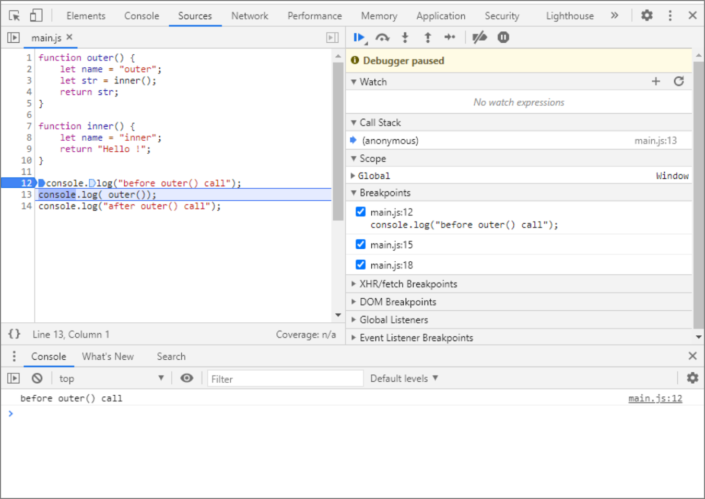

Firefox:

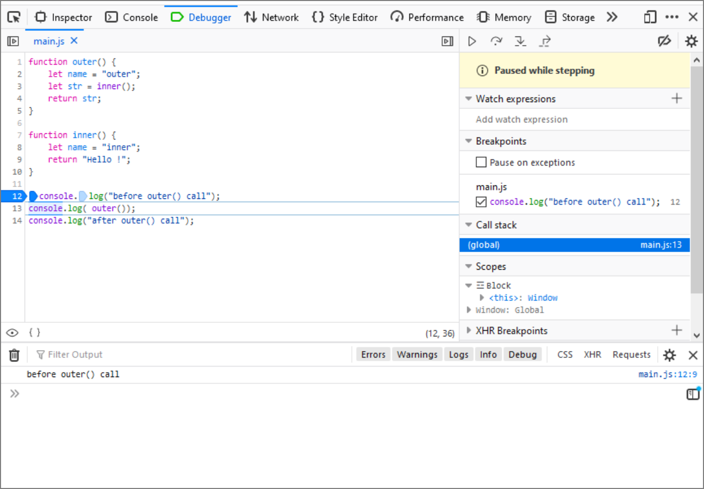

# Step into

Let's see what the difference between **Step Over** and **Step Into** is in practice. Leave the breakpoint setting unchanged, and reload the page. First execute **Step Over** (press the button or the F10 shortcut). Then, when we stop at the `console.log(outer());` line, execute **Step Into**.

What happens? This time the debugger treats the outer function as a set of instructions, jumps inside it and sets itself at its first line. Using **Step Into**, go further into the inner function, and stop on the `return "Hello !"` line.

Chrome:

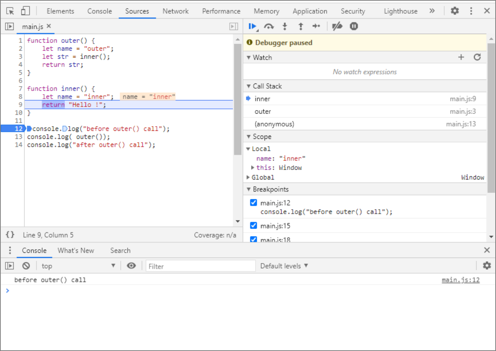

Firefox:

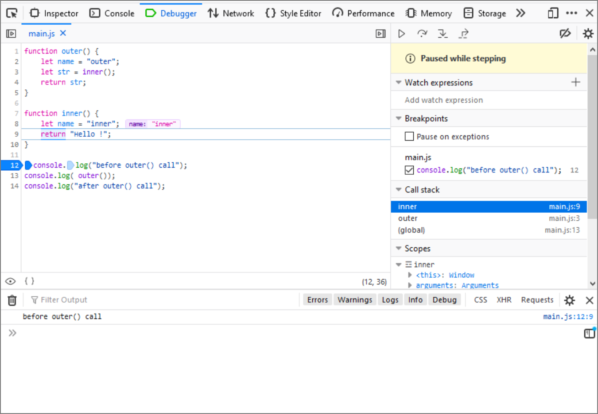

# Call stack

This is a good moment to take a look at another element of the debugger: the **Call Stack**.

In a window with such a name, we can see what function we are currently in (in our case inner). What is more, we will see there all the functions that are currently active. The **Call Stack** is important in the case of nested functions, like in our example.

Using **Step Into**, we call the `outer` function in the main program, step into it, and call the `inner` function. If we stop inside the `inner` function, then the active functions will be: `inner` and `outer`, creating a stack. At the very bottom of the stack, we will see the main function (it doesn't have a name, and in Firefox it is marked as `(global)`, and in Chrome `(anonymous)`). This is the place from where the `outer` function is called.

We stop on line 9, inside the `inner` function, at the` return "Hello !"` command. So we are in the context of the `inner` function at this point. In the console at the bottom of the screen, type the command:

```javascript
console.log(name); // -> inner
```

As a result of its execution, the name "inner" should be displayed. If you click on the name of the outer function on the **Call Stack**, you will be taken to the context of that function (note that the selection of the current line has changed). Try calling the same command again in the console:

```javascript
console.log(name); // -> outer
```

This time we should see "outer". We are in the context of the outer function, which has its own local variable named name. This variable contains the word "outer". Click again on the inner function name in the **Call Stack** to change the context back. Note that despite the context change, the program execution still stops in exactly the same place.

# Viewing and modifying variables

During the step-by-step execution, we have free access to the variables of our program, which are visible in the context we are currently in. As we have just seen, using the console.log method we can write out the values of such variables. We can also modify them without any problem.

Let’s go back to the context of the inner function. Run the following sequence of commands in the console:

```javascript
console.log(name); // -> inner
name = "new name";
console.log(name); // -> new name
```

As you can see, we have modified the value of the local variable name, which is located in the inner function. If we continue the program execution (**Step** or **Resume**), the program will use this new value.

Above the **Call Stack** window is another window called **Watch** (or Watch expressions). It allows us to view and modify the variables without using the console. In this window, we can find the `+` button, which after pressing, allows us to enter the name of the variable whose value changes we want to track.

In order to change the current value of a variable, it is enough to double-click in the watch window on the observed variable, and enter the new value. Remember that during function calls or in code blocks, the scope of variable visibility may vary, so don't be surprised if the values of local variables are not visible in the global context.

Chrome:

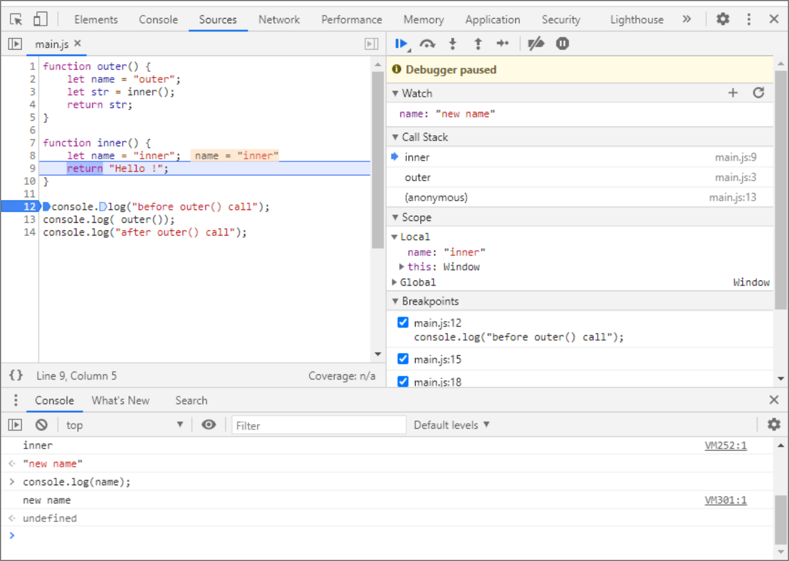

Firefox:

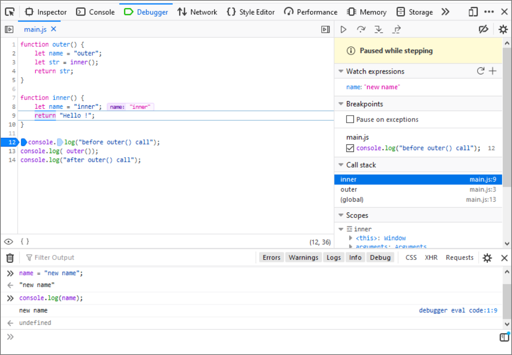

# Step out

During debugging, it can be useful to use one more option. In the panel with the **Resume**, **Step Over**, or **Step Into** buttons, you will also find a **Step Out** button. It resumes program operation by executing successive commands until the current function is exited to the function from which it was called.

Remove all breakpoints and set a new one at line 8, inside the inner function. Reload the program, and execution should stop at the line we’ve marked. Pressing the **Step Out** button will execute the rest of the instructions in the inner function, and stop at the first line after it is called (inside the outer function). Simple, right?

The example we use doesn’t really require debugging. It’s just to demonstrate to you the basic functions of the debugger. You will need them if the program you are going to write behaves inconsistently with your expectations.

Sometimes it is not possible to locate the problem immediately and it is necessary to trace the operation of the program one fragment at a time, preferably using a step-by-step operation. Then we are able to check how the values of variables change in subsequent steps, which commands are executed, or whether or not conditions or loops have been constructed correctly.

The ability to use a debugger is essential for every programmer.

# Measuring code execution time

One of the easiest ways to measure the speed of the program is to use the `console.time` and `console.timeEnd` methods, which allow us to make a precise measurement of the time between two specified places in our code, and display the result on the console. There are of course many more advanced tools, which can help us during the optimization of our code, but it is worth knowing these simple methods, which in many cases are enough to analyze the performance of the program.

Suppose we want to calculate the approximate value of the number π. There are many methods that allow this, one of which is to use the Leibniz formula:

<span style="background-color: white; display: inline-block;">
  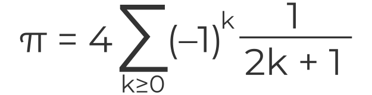
</span>

Which can be expanded into the series:

<span style="background-color: white; display: inline-block;">
  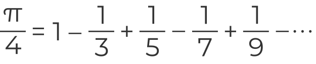
</span>

The value of π calculated in this way is approximate, but it is more accurate the longer the series is. Higher accuracy will of course involve a larger number of operations to be performed and therefore will affect the time of program execution.

Let’s check what an example program written in JavaScript might look like, which would allow us to perform such calculations:

```javascript
let part = 0;
for (let k = 0; k < 10000000; k++) {
    part = part + ((-1) ** k) / (2 * k + 1);
}
let pi = part * 4;
console.log(pi); // -> 3.1415925535897915
```

The variable part will contain a partial result, which will be modified in each iteration of the for loop. The loop will be executed ten million times, meaning `k` will take values from 0 to 999999. The most time-consuming part will be the execution of the for loop, because in each iteration, operations such as summing, multiplying, dividing, and exponentiation are performed.

Let's check how much time it takes for the program to execute this piece of code. For this purpose, we will use the methods `console.time` and `console.timeEnd`.

```javascript
let part = 0;
console.time('Leibniz');
for (let k = 0; k < 10000000; k++) {
    part = part + ((-1) ** k) / (2 * k + 1);
}
console.timeEnd('Leibniz'); // -> Leibniz: 456.60498046875 ms (sample result)
let pi = part * 4;
console.log(pi); // -> 3.1415925535897915
```

With `console.time`, we indicate where to start the time measurement, while with `console.timeEnd` we end the measurement, and the result is displayed on the console at this point. The time is given in milliseconds. In the calls of the `console.time` and `console.timeEnd` methods, we can specify a string that will identify our stopwatch in case we use many of them in our program.

Let's look inside the `for` loop.

In each iteration, the number `-1` is raised to the power of `k`. Exponentiation is quite a time-consuming operation, so we can suspect that it strongly affects the speed of our program. If the base of the exponentiation is the number `-1`, we will always get `-1` or `1` as a result, depending on whether the exponent is odd or even. In this case, we can replace exponentiation with a conditional instruction that checks if `k` is even or odd and returns `1` or `-1` respectively.

```javascript
let part = 0;
console.time('Leibniz');
for(let k = 0; k < 10000000; k++) {
    part = part + (k % 2 ? -1 : 1) / (2 * k + 1);
}
console.timeEnd('Leibniz'); // -> Leibniz: 175.5458984375 ms
let pi = part * 4;
console.log(pi);
```

As you can see, even such a small change allows us to more than double the speed of the program. Using the `console.time` and `console.timeEnd` methods allows us to analyze our code for performance.

If we have the impression that something works too slowly, but we do not know which piece of code is responsible for this, we can perform measurements, locate the problem and, optionally, try to optimize the code. As we said before, there are many tools that also help us in this. Some of them are built into the Developer Tools integrated with the browser, but often the methods shown are enough to perform basic tests.

Try to test both the solutions in your local environment, and see what differences in times you get.